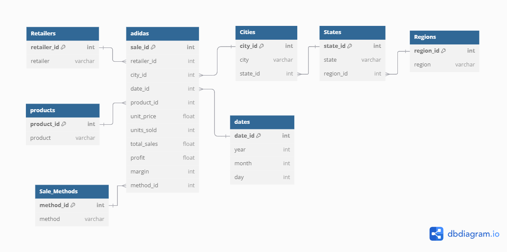
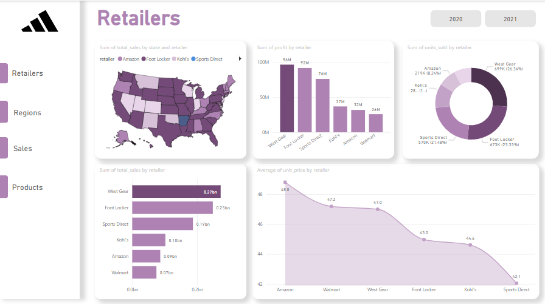

# Adidas US Sales Analysis

## Project Overview
The **Adidas US Sales Analysis** project aims to analyze Adidas' sales data across the United States. The project covers data warehousing, sales analysis, and forecasting using a combination of Python, Power BI, and data modeling techniques.

## Project Goals
- 📊 **Structure the data in a data warehouse**: Organize the sales data into a structured and scalable format for efficient querying and analysis.
- 📈 **Analyze the sales over time in different regions and states**: Gain insights into Adidas' sales patterns across various geographical locations.
- 🔮 **Predict the sales pattern for the next year ("2022")**: Forecast future sales trends using time series analysis and predictive modeling.

## Content
This repository contains:
- 🧼 **Data Cleaning**: Clean and preprocess raw sales data to ensure accuracy and consistency.
- 🏢 **Data Warehousing**: Design and implement a data warehouse to store and manage the sales data efficiently.
- 📊 **Power BI Report**: Visualize the sales data through interactive dashboards and reports.
- 📅 **Sales Forecasting**: Predict future sales trends using the Prophet library and other time series forecasting techniques.

### Data Warehouse Design
The data warehouse is designed to store structured sales data efficiently, enabling quick and accurate insights.

### Power BI Report
Explore the Adidas sales data through interactive and visually appealing Power BI dashboards. 

#### Power BI Report Pages:
- 🏬 **Retailers**: Insights into the sales performance of different retailers.
- 🌎 **Regions**: Analysis of sales trends across various regions and states.
- 💰 **Sales**: Overview of total sales, revenue, and profit margins.
- 🛒 **Products**: Product-level analysis of sales performance and trends.
- 🏷️ **Methods**: Examination of different sales methods and their impact.

---

Feel free to contribute, raise issues, or suggest enhancements!

🚀 **Happy Analyzing!**

